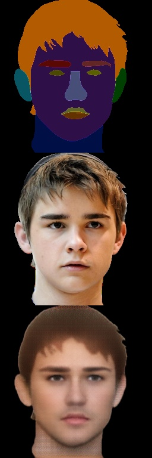

# Leo
Leo is a rough implementation of [Image-to-Image Translation with Conditional Adversarial Networks paper.](https://arxiv.org/abs/1611.07004). It uses [CelebA-Mask-HQ](https://mmlab.ie.cuhk.edu.hk/projects/CelebA/CelebAMask_HQ.html) dataset to generate faces based on a hand-drawn mask and features a simple editor to draw the masks.

## Instructions
### Requirements
The following python3 libraries are required:
- Keras
- Tensorflow
- Numpy
- OpenCV 2
- Pandas
- PyQT5

`pip install keras tensorflow opencv-python pandas PyQT5 numpy`

### Configuration
Modify `consts.py`

### Training
1. Download [CelebA-Mask-HQ](https://mmlab.ie.cuhk.edu.hk/projects/CelebA/CelebAMask_HQ.html) dataset and extract them to the *original_images_path* and *original_images_path* paths that are specified in `consts.py`.
2. Preprocess the data by running `preprocess.py`. The preprocessed data will be placed in *images_data_path* and *masks_data_path* specified in `consts.py`.
3. Run `train.py`. You can modify the variable *continue_training* variable if you want to continue traininig the models later on.

**NOTE:** Preview images will be placed in the *preview_dir* directory specified in `consts.py`.

  

### Usage
You can either run `editor.py` to create hand drawings, or you can run `record.py` to see how you would look.
